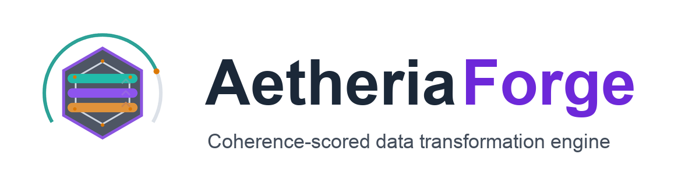

<p align="center">
  
</p>

# Intelligent Data Transformation. Coherence-Scored. Evidence-Backed.

**EthereaLogic Databricks Suite — AetheriaForge**

Built by Anthony Johnson | EthereaLogic LLC

---

<p align="left">
  <a href="https://github.com/Org-EthereaLogic/AetheriaForge/actions/workflows/ci.yml"></a>
  <a href="https://pypi.org/project/etherealogic-aetheriaforge/"></a>
  <a href="https://app.codacy.com/gh/Org-EthereaLogic/AetheriaForge/dashboard"></a>
  <a href="https://codecov.io/gh/Org-EthereaLogic/AetheriaForge"></a>
</p>

---

Every Medallion transformation introduces information loss. Most pipelines ignore it. AetheriaForge measures it — scoring every transformation for coherence, reconciling entities across source systems, merging temporal conflicts, and enforcing schema contracts with versioned evolution. Every operation produces append-only evidence. Nothing is assumed to have passed unless the artifact says so.

## Executive Summary

| Leadership question | Answer |
| ------------------- | ------ |
| What business risk does this address? | Enterprises transforming data through Bronze to Silver to Gold layers have no mathematical model governing how much information loss is acceptable at each stage, no governed entity resolution across source systems, and no auditable evidence trail for transformation decisions. |
| What does this application prove? | A Databricks-deployable transformation engine that scores every operation for coherence, resolves entities across multiple sources, reconciles temporal conflicts, and surfaces queryable evidence artifacts in a read-only operator dashboard. |
| Why does it matter? | Moving data between layers is not the hard problem. Proving that the transformation preserved what it should, resolved what it needed to, and caught what it missed — with evidence — is the problem this solves. |

## The Business Problem

Enterprises operating mature Lakehouse architectures face three transformation gaps that existing tools do not address:

- **Coherence loss is unmeasured.** Every transformation from Bronze to Silver to Gold discards, reshapes, or aggregates data. Without a coherence score, there is no way to know whether the output meets the target layer's quality threshold before writing it.

- **Entity resolution is ad-hoc.** Multiple source systems use different identifiers for the same entities. Lookup tables and manual mappings do not scale, version, or produce evidence of match decisions.

- **Temporal reconciliation is invisible.** CDC streams, SCD Type 2 dimensions, and batch loads create overlapping records with conflicting timestamps. Merge decisions happen silently with no audit trail.

## What This Repository Contains

| Surface | Purpose |
| ------- | ------- |
| `src/aetheriaforge/ingest/` | Enterprise file ingestion — CSV, Parquet, JSON, Excel, XML, ORC, Avro, and more |
| `src/aetheriaforge/forge/` | Coherence-scored transformation engine (Shannon entropy v1.x) |
| `src/aetheriaforge/resolution/` | Cross-source entity resolution with configurable matching rules |
| `src/aetheriaforge/temporal/` | Temporal reconciliation across CDC, SCD Type 2, and batch sources |
| `src/aetheriaforge/schema/` | Schema enforcement and versioned evolution management |
| `src/aetheriaforge/evidence/` | Append-only transformation artifact writing shared across all modules |
| `src/aetheriaforge/orchestration/` | Workflow sequencing — runs all forge operations in order |
| `src/aetheriaforge/config/` | Forge contract and policy configuration |
| `src/aetheriaforge/integration/` | Optional DriftSentinel event emission and drift payload ingestion |
| `app/` | Databricks App (Gradio) — four-tab read-only operator dashboard |
| `notebooks/` | Onboarding, execution, and evidence-review notebooks for Databricks |
| `resources/` | Databricks Asset Bundle pipeline, job, and app resource definitions |
| `templates/` | Forge contract, resolution policy, and schema contract templates |
| `specs/` | Canonical SDLC documents governing the product |
| `tests/` | Pytest suite covering domain logic, packaging, and governance |

Every directory above contains a `README.md` describing its contents, including each submodule under `src/aetheriaforge/`.

## What This Repository Proves

| Verified outcome | Evidence from this repository |
| ---------------- | ----------------------------- |
| Coherence scoring measures information loss at every transformation | Forge engine computes Shannon entropy before and after, producing a 0.0–1.0 coherence score per operation with configurable thresholds |
| Entity resolution produces governed match evidence | Resolution module matches records across source systems using configurable key-based rules and writes match decisions to append-only artifacts |
| Temporal reconciliation resolves conflicts with an audit trail | Temporal reconciler merges CDC, SCD Type 2, and batch records with strategy-driven conflict resolution and evidence of every merge decision |
| Schema enforcement is contract-driven and versioned | Schema enforcer validates output against versioned YAML contracts with evolution management for added, removed, and type-changed columns |
| Enterprise file ingestion handles heterogeneous sources | Ingest module supports 10 formats with auto-detection, producing evidence metadata for every read operation |
| Evidence artifacts are queryable without writing scripts | Operator dashboard surfaces all artifacts with coherence scores, verdicts, timestamps, and provenance metadata across four tabs |
| Databricks deployment workflow is defined for a configured workspace | Asset Bundle resources and deployment docs cover validate, deploy, and app status checks; replay requires Databricks credentials and Unity Catalog |
| DriftSentinel integration is standalone-safe | Event emission and drift ingestion are optional — NullEventChannel is the default, and no runtime dependency on DriftSentinel exists |

## Decision / KPI Contract

**Business decision:** is the forged output trustworthy enough for the target Medallion layer?

| KPI | Meaning |
| --- | ------- |
| `coherence_score` | Information preservation ratio for the transformation (0.0–1.0) |
| `resolution_confidence` | Match confidence for entity resolution decisions |
| `temporal_conflicts` | Count of temporal merge conflicts detected |
| `schema_conformance` | Percentage of records conforming to the target schema contract |
| `transformation_verdict` | PASS / WARN / FAIL for each forge operation |

**Control rule:** no transformation is assumed to have passed unless a PASS artifact exists in the evidence directory. FAIL artifacts carry measured values and thresholds so the platform team can triage without opening raw files.

## Why This Pattern

- **Gap 1.** Transformation quality must be measured, not assumed. Shannon entropy coherence scoring gives every operation a mathematical signal — not a boolean check, but a ratio that tells you how much information the transformation preserved relative to the source.
- **Gap 2.** Entity resolution and temporal reconciliation must produce evidence. Match decisions and merge outcomes are written to the same append-only evidence directory as forge artifacts. A single dashboard surfaces all of them without special-casing any module.
- **Gap 3.** The operator dashboard must be read-only. The Gradio app exposes no write surfaces. Evidence is queried, never edited through the UI. This keeps the audit trail clean and the deployment governance simple.

## How It Works

1. **Register datasets and forge contracts.** Each dataset is registered with a YAML contract specifying source location, target schema, resolution rules, temporal merge policy, and coherence thresholds. File-backed datasets use a landing path; table-backed datasets use the `catalog/schema/table` triplet.
2. **Run the forge pipeline.** The orchestration layer runs schema enforcement, coherence-scored transformation, entity resolution, and temporal reconciliation in sequence. Each module writes an append-only evidence artifact to the shared evidence directory.
3. **Inspect transformation evidence.** The Forge Registry tab shows all registered datasets with contract versions and locations. The Transformation Status tab surfaces artifacts with coherence scores, verdicts, and provenance. The Evidence Explorer loads any single artifact by filename and renders the full JSON payload. The Analytics tab renders verdict distribution, coherence trends, daily volume, and health over time.
4. **Integrate with DriftSentinel (optional).** When bundled, AetheriaForge emits transformation events that DriftSentinel can consume for smarter publication gating, and receives drift payloads for auto-remediation. When standalone, the NullEventChannel silently drops events with zero overhead.

## Databricks Fit

- **Databricks Asset Bundles** for source-controlled deployment of pipeline, job, and app resource definitions — validated and deployed from the repo with a single make target.
- **Databricks Apps (Gradio)** for a governed, read-only operator dashboard with no custom web infrastructure required.
- **Unity Catalog** for governed table publication and the evidence volume backing the operator dashboard.
- **Databricks Lakeflow / Jobs** for scheduled forge pipeline execution across registered datasets.
- AetheriaForge is contract-driven rather than domain-hardcoded. Registered datasets can vary by schema and source system, but supported execution depends on the declared file or table format, schema contract, and the forge logic implemented in this repository.

## Quickstart

### Install via pip

The fastest way to get the AetheriaForge package into your environment:

```bash
pip install etherealogic-aetheriaforge
```

This installs the full AetheriaForge package — coherence-scored transformation engine, entity resolution, temporal reconciliation, schema enforcement, evidence writer, orchestration, and bundled contract and policy templates.

For enterprise file ingestion (Excel, XML, ORC, Avro, Parquet):

```bash
pip install "etherealogic-aetheriaforge[ingest]"
```

### Clone and develop locally

To run the full test suite or contribute:

```bash
git clone https://github.com/Org-EthereaLogic/AetheriaForge.git
cd AetheriaForge

make sync   # installs runtime + dev dependencies via uv
make test   # runs the pytest suite
```

### Databricks Bundle and App Deployment

```bash
# First prove the catalog exists for your profile.
make bundle-catalog-check CATALOG=my_catalog PROFILE=<profile>

# Validate bundle wiring against that catalog.
make bundle-validate CATALOG=my_catalog PROFILE=<profile>

# Deploy bundle resources and start the Databricks App.
make app-deploy CATALOG=my_catalog PROFILE=<profile>
```

Direct CLI path:

```bash
databricks catalogs get my_catalog -p <profile>
databricks bundle validate -p <profile> --target dev --var="catalog=my_catalog"
databricks bundle deploy -p <profile> --target dev --var="catalog=my_catalog"
databricks apps start aetheriaforge -p <profile>
databricks apps deploy -p <profile> --target dev --var="catalog=my_catalog"
databricks apps get aetheriaforge -p <profile> -o json
```

`bundle validate` proves bundle, auth, and resource resolution. `databricks apps get` is the proof surface for `SUCCEEDED` plus `RUNNING`.

### Notebook Import

Import the `notebooks/` directory into your Databricks workspace to run the forge pipeline from the deployed bundle or standalone from GitHub. Notebooks prefer the workspace source tree when bundle-synced under `/Workspace/...` and otherwise install AetheriaForge from GitHub. Real dataset execution requires:

- a registered forge contract with source format and either a landing path or table name
- a schema contract defining the target layer's expected columns and types
- optional resolution and temporal policies for cross-source datasets
- for Databricks volume-backed files, use `/Volumes/...` notebook paths; avoid `/dbfs/Volumes/...`

## AI-Assisted Setup

If you use an AI coding agent (Claude Code, Cursor, GitHub Copilot Workspace, or similar), paste the prompt below directly into your agent session. The agent will clone the repository, install dependencies, run the full test suite, and walk you through the Databricks deployment — no manual steps required.

**Before you start, have these ready:**

- Python 3.11+
- `uv` package manager — install with `pip install uv`
- Databricks CLI configured with a valid profile — run `databricks auth login` if needed
- A Databricks workspace with Unity Catalog enabled
- The name of your Unity Catalog catalog

**Copy and paste this prompt into your AI coding agent:**

````
I want to set up AetheriaForge — a Databricks-deployable intelligent data
transformation engine that coherence-scores every Medallion layer transformation,
resolves entities across source systems, reconciles temporal conflicts, and
surfaces queryable evidence in a four-tab operator dashboard.

Repository: https://github.com/Org-EthereaLogic/AetheriaForge

Please complete these steps in order. Stop at any failure and report it before continuing.

1. Clone the repository:
   git clone https://github.com/Org-EthereaLogic/AetheriaForge.git
   cd AetheriaForge

2. Install dependencies (requires uv):
   make sync
   If uv is not installed: pip install uv

3. Run the full test suite. The full pytest suite must pass before proceeding:
   make test

4. Read these files to understand the configuration model before deployment:
   - README.md
   - templates/forge_contract.yml
   - templates/resolution_policy.yml
   - templates/schema_contract.yml

5. Ask me for my Databricks setup details:
   - My Unity Catalog catalog name
   - My Databricks CLI profile name
   Then confirm the catalog is reachable:
   make bundle-catalog-check CATALOG=<my_catalog> PROFILE=<my_profile>

6. Validate the Asset Bundle against my workspace:
   make bundle-validate CATALOG=<my_catalog> PROFILE=<my_profile>

7. If validation passes, deploy the bundle and start the Databricks App:
   make app-deploy CATALOG=<my_catalog> PROFILE=<my_profile>

8. Verify the deployment succeeded:
   databricks apps get aetheriaforge -p <my_profile> -o json
   Confirm the status shows SUCCEEDED and RUNNING, then report the app URL.

After every step, report what happened. Do not skip a step or proceed past any
error without explaining it and asking me how to continue.
````

## Scope Boundary

AetheriaForge validates the coherence-scored transformation model using registered datasets in a local and Databricks environment. It supports contract-driven execution for heterogeneous tabular schemas across common enterprise file formats (`csv`, `tsv`, `parquet`, `json`/`jsonl`, `excel`, `xml`, `orc`, `avro`, `fixed-width`) and Spark/Unity Catalog tables. It does not yet constitute production-scale proof across every schema shape, every data size, or every multi-workspace deployment pattern. The Databricks deployment path still requires a workspace with Unity Catalog enabled.

## Engineering Signals

- GitHub Actions workflow: [ci.yml](https://github.com/Org-EthereaLogic/AetheriaForge/actions/workflows/ci.yml)

## Additional Documentation

- [Architecture and design rationale](specs/AF-SDD-001_Architecture_Blueprint.md)
- [Implementation plan](specs/AF-IP-001_Implementation_Plan.md)

## Part of the EthereaLogic Databricks Suite

AetheriaForge is the second product in the **EthereaLogic Databricks Suite** — a portfolio of Databricks-deployable applications addressing the full lifecycle of data reliability in enterprise Lakehouse platforms.

| Product | Core Job | Primary Layer |
| ------- | -------- | ------------- |
| [DriftSentinel](https://github.com/Org-EthereaLogic/DriftSentinel) | Detect drift, block bad publishes | Bronze (detection) + Silver/Gold (gating) |
| **AetheriaForge** | Transform, reconcile, forge clean data | Silver (transformation engine) |
| EthereaLogic Suite (bundled) | Full governed Medallion pipeline | Bronze to Silver to Gold |

When both products are deployed, AetheriaForge emits transformation events that DriftSentinel consumes for smarter publication gating, and DriftSentinel feeds drift payloads back for auto-remediation. Each product operates independently when the other is absent.

---

MIT License. See [LICENSE](LICENSE) for details.
